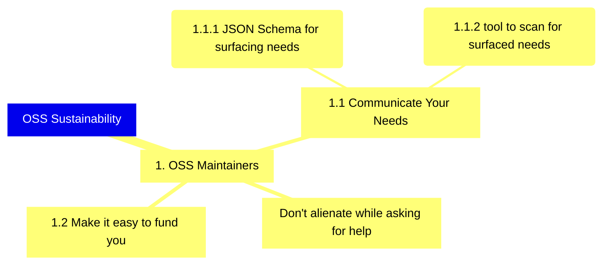
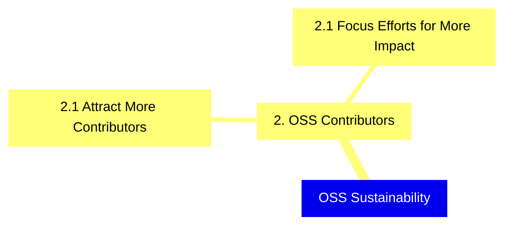
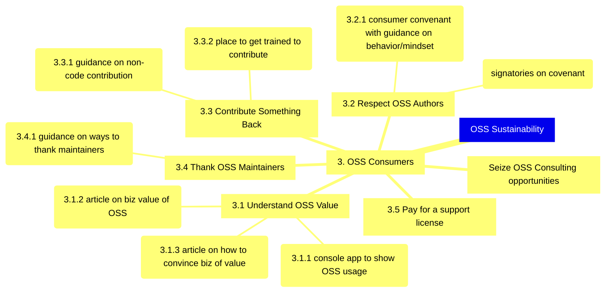
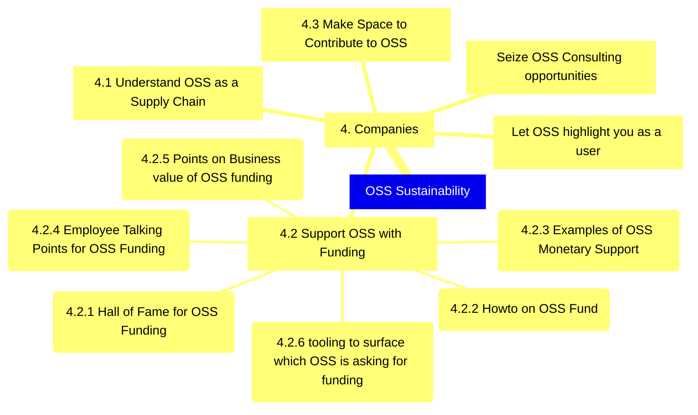
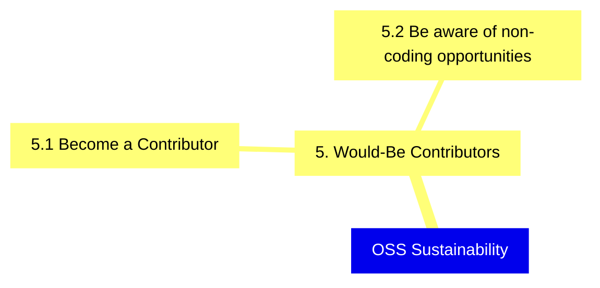
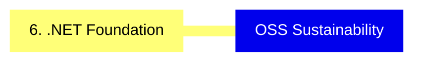
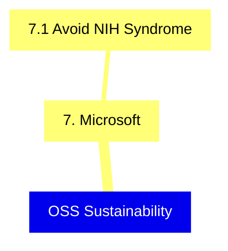
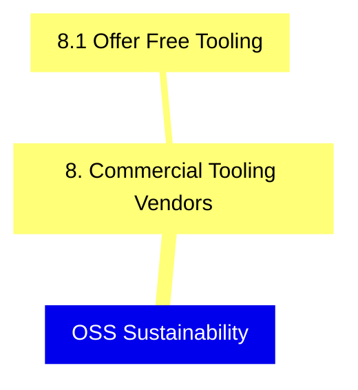

# Welcome to AWider.NET!

AWiderDotNet is a community dedicated to furthering sustainability and community in .NET open source, though we hope it will be applicable far beyond the .NET world as well.

This home repository is the best way to find your way around the org and our efforts.

## A Focus on Impact

At its heart, this project is about mapping out the different ways we might achieve better outcomes around OSS sustainability and community, and creating space/focus for those outcomes to happen.

To achieve these impacts, we're using [a tool commonly known as impact mapping](https://www.impactmapping.org) which allows for divergent ideas and a way of thinking about influencing outcomes that we think will be very helpful. We'll use the impact map items to drive a rough outline of priorities for our organization, at which point we'll explore the problem space and then welcome contributions around those items.

## Principles

* **No one's coming to save us.** This is about the community taking responsibility for itself, first and foremost. We love orgs like the .NET Foundation but we believe something completely independent is necessary.
* **A bias toward action**. We will be keeping a keen focus on what we can do from where we are.
* **Making space to participate**. This is a multifaceted challenge and we're going to find a way for people to jump in where they're most passionate.

## Introducing the Impact Maps

Normally this would be a very large map, but for the ease of reading we're breaking the map up by the second level (the "who")
. There will be some overlapping items but we'll do our best to organize it for disocverability.

You can read this as: "(Person/Group) -- Can support OSS sustainability by -> (behavior change)  -- which we can influence by -> (thing we can do)".

## 1. OSS Maintainers

## 2. OSS Contributors

## 3. OSS Consumers

## 4. Companies

## 5. Would-Be Contributors

## 6. .NET Foundation

## 7. Microsoft

## 8. Commercial Vendors

